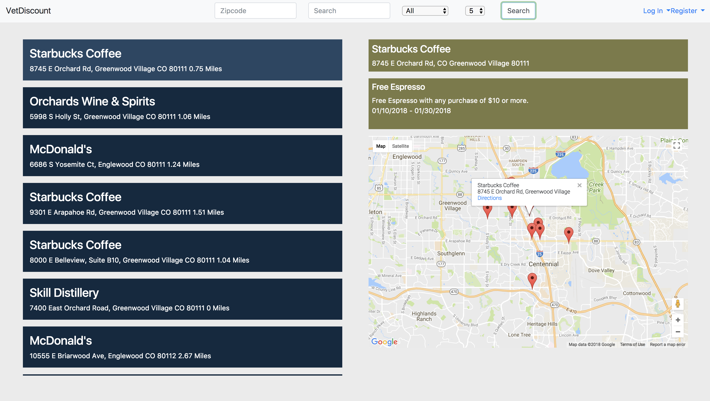
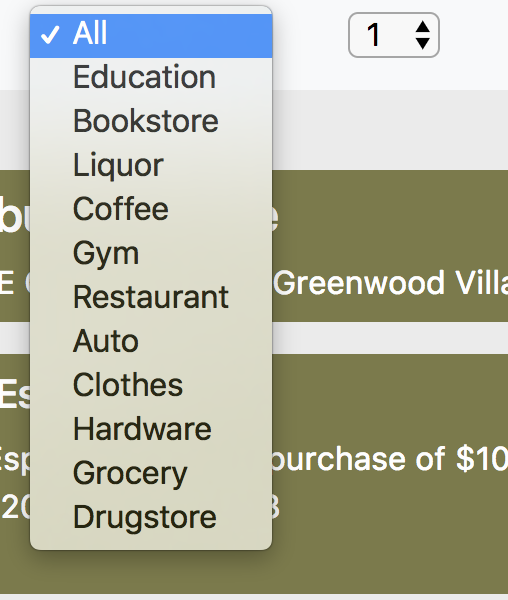
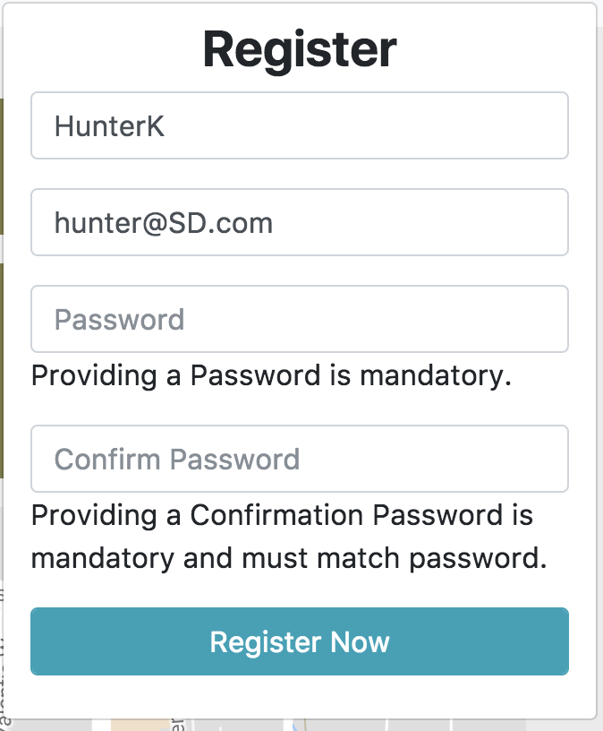
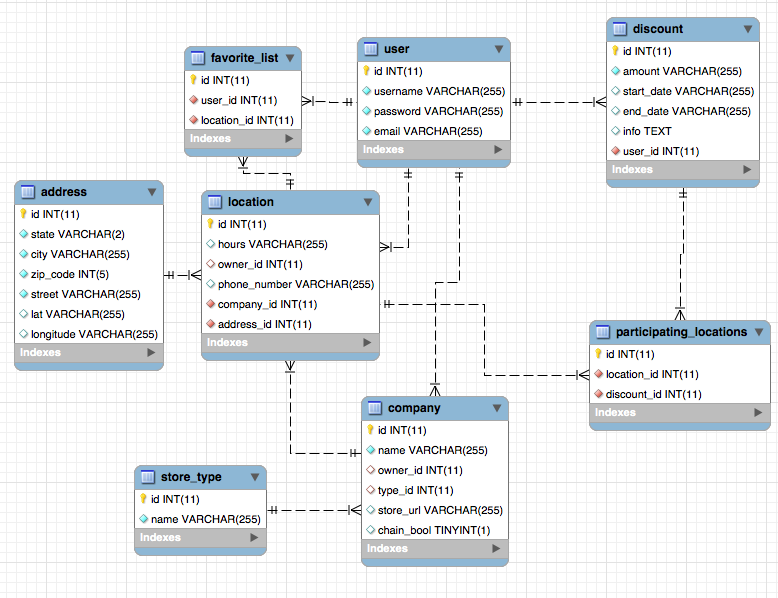

# Veterans Discount API
Final project for Skill Distillery Full-Stack Java Coding Program
Created by Jacob Simms, Aaron Ipp, Hunter Kiritsis, Alex Perez !!

The Application

In the past finding military discounts was a long and arduous process. With Vet Discount you can find and share
military discounts in your local area.

Users can:
 - Create an Account
 - Login
 - View Posted Discounts near you
 - Create discounts and businesses that are not listed
 - Edit information you have posted
 - Search through discounts in your area
 - Filter search results to better find what you are looking for

Technologies used:
 - JAVA		
 - SPRING
 - JPA
 - MYSQL
 - ANGULARJS

The home page is the search page.
To do search you do not need an account.
In order to create a new discount please create an account or
use the pre made tester account Username: HunterK Password: password123

When you click on a label on the right the panels on the right and the map
will display information about that location and its discounts

You can filter your search by keyword, business type, or distance from your location.

By clicking register the user will see a form to create a new account.

Database Schema

Technologies Used

